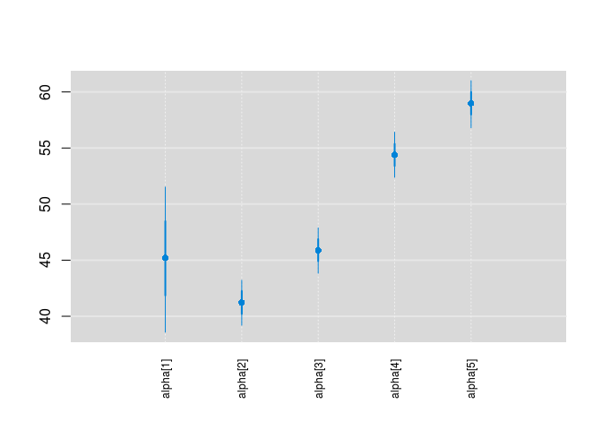
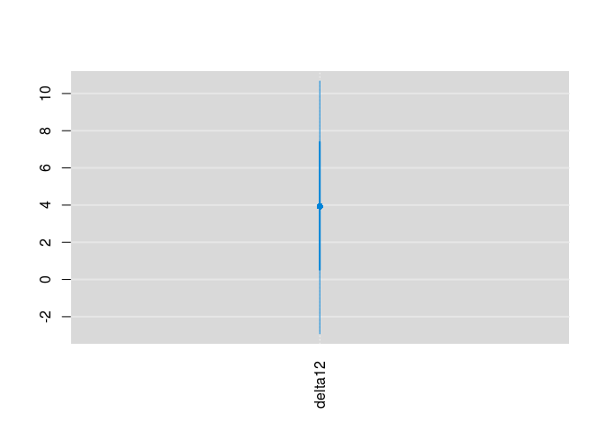
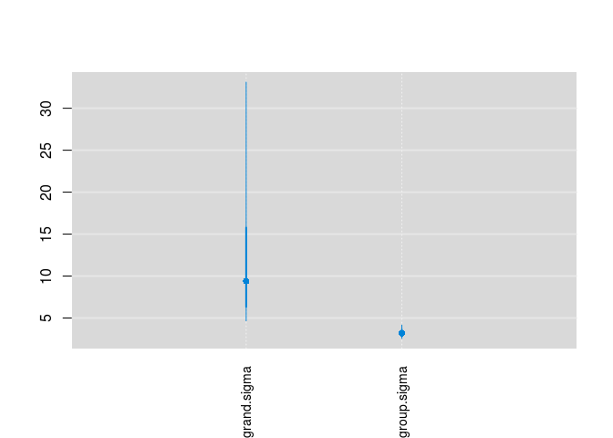
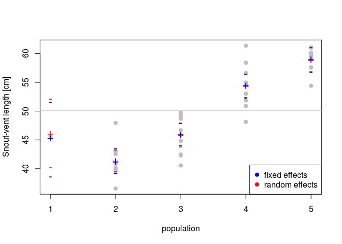

# ANOVA -- **part 2**: Fixed and random effects in JAGS
Petr Keil  
March 2017  

***

# Objective

The aim of this lesson is to leave the participants to come up with their
code for simple one-way ANOVA (part 1), and to experiment with random effects ANOVA (part 2).

***

# The Data

We will use modified data from the example from **Marc Kery's Introduction to WinBUGS for Ecologists**, page 119 (Chapter 9 - ANOVA). The data describe snout-vent lengths in 5 populations of Smooth snake (*Coronella austriaca*).


***

Loading the data from the web:

```r
  snakes <- read.csv("http://www.petrkeil.com/wp-content/uploads/2014/02/snakes.csv")

# we will artificially delete 9 data points in the first population
  snakes <- snakes[-(1:9),]
  
  summary(snakes)
```

```
##    population      snout.vent   
##  Min.   :1.000   Min.   :36.56  
##  1st Qu.:2.000   1st Qu.:43.02  
##  Median :3.000   Median :49.24  
##  Mean   :3.439   Mean   :50.07  
##  3rd Qu.:4.000   3rd Qu.:57.60  
##  Max.   :5.000   Max.   :61.37
```

Plotting the data:

```r
  par(mfrow=c(1,2))
  plot(snout.vent ~ population, data=snakes,
       ylab="Snout-vent length [cm]")
  boxplot(snout.vent ~ population, data=snakes,
          ylab="Snout-vent length [cm]",
          xlab="population",
          col="grey")
```

<!-- -->

***

# Fixed-effects ANOVA in JAGS

For a given snake $i$ in population $j$ **the model** can be written as:

$y_{ij} \sim Normal(\alpha_j, \sigma)$

Here is how we prepare the data:

```r
  snake.data <- list(y=snakes$snout.vent,
                     x=snakes$population,
                     N=nrow(snakes), 
                     N.pop=5)
```

Loading the library that communicates with JAGS


```r
  library(R2jags)
```

JAGS Model definition:


```r
cat("
  model
  {
    # priors
    sigma ~ dunif(0,100)
    tau <- 1/(sigma*sigma)
    for(j in 1:N.pop)
    {
      alpha[j] ~ dnorm(0, 0.001)
    }
  
    # likelihood
    for(i in 1:N)
    {
      y[i] ~ dnorm(alpha[x[i]], tau)
    }

    # derived quantity
    delta12 <- alpha[1] - alpha[2]
  }
", file="fixed_anova.txt")
```

And we will fit the model:


```r
model.fit.fix <- jags(data=snake.data, 
                        model.file="fixed_anova.txt",
                        parameters.to.save=c("alpha", "delta12"),
                        n.chains=3,
                        n.iter=2000,
                        n.burnin=1000,
                        DIC=FALSE)
```

```
## module glm loaded
```

```
## module dic loaded
```

```
## Compiling model graph
##    Resolving undeclared variables
##    Allocating nodes
## Graph information:
##    Observed stochastic nodes: 41
##    Unobserved stochastic nodes: 6
##    Total graph size: 107
## 
## Initializing model
```

```r
model.fit.fix
```

```
## Inference for Bugs model at "fixed_anova.txt", fit using jags,
##  3 chains, each with 2000 iterations (first 1000 discarded)
##  n.sims = 3000 iterations saved
##          mu.vect sd.vect   2.5%    25%    50%    75%  97.5%  Rhat n.eff
## alpha[1]  45.174   3.309 38.581 42.954 45.214 47.412 51.522 1.001  3000
## alpha[2]  41.223   1.021 39.200 40.551 41.223 41.913 43.216 1.001  3000
## alpha[3]  45.881   1.018 43.833 45.214 45.883 46.541 47.885 1.001  3000
## alpha[4]  54.388   1.015 52.390 53.756 54.395 55.025 56.413 1.001  3000
## alpha[5]  58.979   1.039 56.808 58.322 58.991 59.659 61.013 1.001  3000
## delta12    3.950   3.470 -2.916  1.650  3.940  6.300 10.676 1.001  3000
## 
## For each parameter, n.eff is a crude measure of effective sample size,
## and Rhat is the potential scale reduction factor (at convergence, Rhat=1).
```

Plotting parameter estimates with `mcmcplots`


```r
library(mcmcplots)

caterplot(model.fit.fix, parms="alpha", horizontal=FALSE, reorder=FALSE)
```

<!-- -->

Is there a difference between population 1 and 2?


```r
caterplot(model.fit.fix, parms="delta12", horizontal=FALSE, reorder=FALSE)
```

<!-- -->

***

# Random-effects ANOVA in JAGS

For a given snake $i$ in population $j$ **the model** can be written in a similar way as for the fixed-effects ANOVA above:

$y_{ij} \sim Normal(\alpha_j, \sigma)$

But now we will also add a **random effect**:

$\alpha_j \sim Normal(\mu_{grand}, \sigma_{grand})$

In short, a **random effect means that the parameters itself come from (are outcomes of) a given distribution**, here it is the Normal.

***

The data stay the same as in the fixed-effect example above.

Loading the library that communicates with JAGS

```r
  library(R2jags)
```

JAGS Model definition:

```r
cat("
  model
  {
    # priors
    grand.mean ~ dnorm(0, 0.001)
    grand.sigma ~ dunif(0,100)
    grand.tau <- 1/(grand.sigma*grand.sigma)
    group.sigma ~ dunif(0, 100)
    group.tau <- 1/(group.sigma*group.sigma)
  
    for(j in 1:N.pop)
    {
      alpha[j] ~ dnorm(grand.mean, grand.tau)
    }
  
    # likelihood
    for(i in 1:N)
    {
      y[i] ~ dnorm(alpha[x[i]], group.tau)
    }

    # derived quantity
    delta12 <- alpha[1] - alpha[2]
  }
", file="random_anova.txt")
```

And we will fit the model:


```r
model.fit.rnd <- jags(data=snake.data, 
               model.file="random_anova.txt",
               parameters.to.save=c("alpha", "grand.sigma", "group.sigma"),
               n.chains=3,
               n.iter=2000,
               n.burnin=1000,
               DIC=FALSE)
```

```
## Compiling model graph
##    Resolving undeclared variables
##    Allocating nodes
## Graph information:
##    Observed stochastic nodes: 41
##    Unobserved stochastic nodes: 8
##    Total graph size: 107
## 
## Initializing model
```

```r
model.fit.rnd
```

```
## Inference for Bugs model at "random_anova.txt", fit using jags,
##  3 chains, each with 2000 iterations (first 1000 discarded)
##  n.sims = 3000 iterations saved
##             mu.vect sd.vect   2.5%    25%    50%    75%  97.5%  Rhat n.eff
## alpha[1]     46.093   3.082 40.129 44.070 46.085 48.142 52.087 1.002  2000
## alpha[2]     41.362   1.035 39.439 40.690 41.343 42.019 43.524 1.001  3000
## alpha[3]     45.973   1.004 44.050 45.292 45.952 46.633 47.981 1.001  3000
## alpha[4]     54.372   1.044 52.304 53.683 54.369 55.057 56.442 1.001  3000
## alpha[5]     58.898   1.013 56.853 58.239 58.882 59.572 60.996 1.001  3000
## grand.sigma  11.478   7.438  4.671  7.101  9.394 12.921 33.126 1.013   330
## group.sigma   3.232   0.404  2.571  2.944  3.187  3.464  4.155 1.003   720
## 
## For each parameter, n.eff is a crude measure of effective sample size,
## and Rhat is the potential scale reduction factor (at convergence, Rhat=1).
```

Plotting parameter estimates with `mcmcplots`


```r
library(mcmcplots)

caterplot(model.fit.rnd, parms="alpha", horizontal=FALSE, reorder=FALSE)
```

<!-- -->

```r
caterplot(model.fit.rnd, parms=c("grand.sigma", "group.sigma"), horizontal=FALSE)
```

<!-- -->


# Plotting the posteriors from both models

Let's extract the medians posterior distributions of the expected values of $\alpha_j$ and their 95% credible intervals:

```r
  rnd.alphas <- model.fit.rnd$BUGSoutput$summary
  fix.alphas <- model.fit.fix$BUGSoutput$summary
  
  plot(snout.vent ~ population, data=snakes,
       ylab="Snout-vent length [cm]", col="grey", pch=19)
  points(rnd.alphas[,'2.5%'], col="red", pch="-", cex=1.5)
  points(fix.alphas[,'2.5%'], col="blue", pch="-", cex=1.5) 
  points(rnd.alphas[,'97.5%'], col="red", pch="-", cex=1.5)
  points(fix.alphas[,'97.5%'], col="blue", pch="-", cex=1.5) 
  points(rnd.alphas[,'50%'], col="red", pch="+", cex=1.5)
  points(fix.alphas[,'50%'], col="blue", pch="+", cex=1.5) 

  abline(h=mean(snakes$snout.vent), col="grey")
  legend("bottomright", pch=c(19,19), col=c("blue","red"),
         legend=c("fixed effects","random effects"))
```

<!-- -->

***


