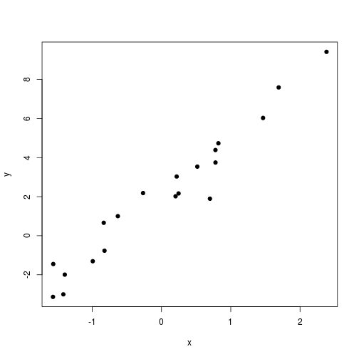
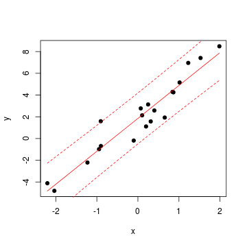
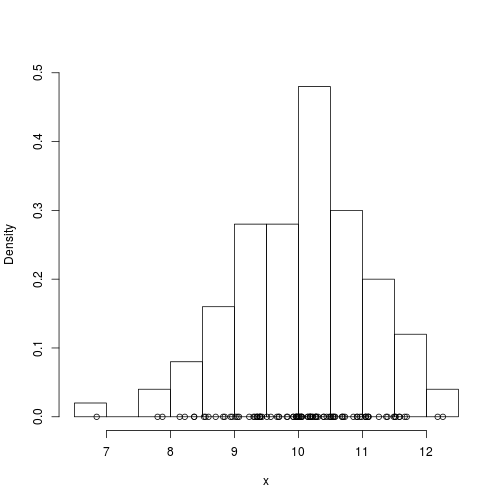
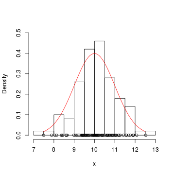

Bayesian Biostatistics
========================================================

Petr Keil 

1-3 March 2017, iDiv


Contents
========================================================
***DAY 1***
- Likelihood, probability distributions
- First Bayesian steps

***DAY 2***
- First Bayesian steps
- Classical models (regression, ANOVA)

***DAY 3***
- Advanced models (mixed, latent variables)
- Inference, uncertainty, model selection.

Introduction
========================================================
- I am not a statistician.
- I will show the basics, you figure out the rest.
- Do ask questions and interrupt!

It would be wonderful if, after the course, you would:
- Not be intimidated by Bayesian and ML papers.
- Get the foundations and some of useful connections between concepts to build on.
- See statistics as a simple construction set (e.g. Lego), rather than 
as a series of recipes.
- Have a statistical [satori](https://en.wikipedia.org/wiki/Satori).


========================================================


*Statistical models are stories about how the data came to be.*

========================================================


*Parametric statistical modeling* means describing a caricature of the "machine" that plausibly could have produced the nubmers we observe.

Kéry 2010

Data
========================================================

```
             x          y
1  -2.00891759 -3.5958356
2  -1.73666836 -2.3097089
3  -1.44270105 -1.3216507
4  -1.31910570 -1.3521506
5  -0.96997693 -0.6193510
6  -0.52789809  0.5583636
7  -0.39306081  1.0985542
8  -0.30834826  1.3306952
9   0.03697981  2.0264832
10  0.04483166  1.4511366
11  0.24907778  1.3033032
12  0.52399462  2.5591704
13  0.53552821  1.4147328
14  0.64351120  4.8814696
15  0.67618944  4.1210663
16  0.94662069  4.7640933
17  0.99478589  3.8805494
18  1.15484147  5.2061357
19  1.28111324  6.8281364
20  2.00988502  7.5959327
```

Data
========================================================


Data, model, parameters
========================================================


$y_i \sim Normal(\mu_i, \sigma)$

$\mu_i = a + b \times x_i$ 

Can you separate the **deterministic** and the **stochastic** part?

Data
========================================================


Data, model, parameters
========================================================


Can you separate the **deterministic** and the **stochastic** part?

$x_i \sim Normal(\mu, \sigma)$

Can you tell what is based on a parametric model?
========================================================
- Permutation tests
- Normal distribution
- Kruskall-Wallis test
- Histogram
- t-test
- Neural networks, random forests
- ANOVA
- Survival analysis
- Pearson correlation
- PCA (principal components analysis)


Elementary notation
========================================================
- $P(A)$ vs $p(A)$ ... Probability vs probability density
- $P(A \cap B)$ ... Joint (intersection) probability (AND)
- $P(A \cup B)$ ... Union probability (OR)
- $P(A|B)$ ... Conditional probability (GIVEN THAT)
- $\sim$ ... is distributed as
- $x \sim N(\mu, \sigma)$ ... x is a normally distributed **random variable**
- $\propto$ ... is proportional to (related by constant multiplication)

Elementary notation
========================================================
- $P(A)$ vs $p(A)$
- $P(A \cap B)$
- $P(A \cup B)$
- $P(A|B)$
- $\sim$ 
- $\propto$ 

Data, model, parameters
========================================================

Let's use $y$ for data, and $\theta$ for parameters.

$p(\theta | y, model)$ or $p(y | \theta, model)$ 

The model is always given (assumed), and usually omitted:

$p(y|\theta)$  ... "likelihood-based" or "frequentist" statistics 

$p(\theta|y)$ ... Bayesian statistics

Why go Bayesian?
========================================================
- Numerically tractable for models of any **complexity**.
- Unbiased for **small sample sizes**.
- It works with **uncertainty**.
- Extremely **simple inference**.
- The option of using **prior information**.
- It gives **perspective**.

The pitfalls
========================================================
- Steep learning curve.
- Tedious at many levels. 
- You will have to learn some programming.
- It can be computationally intensive, slow.
- Problematic model selection.
- Not an exploratory analysis or data mining tool.

To be thrown away
========================================================
- Null hypotheses formulation and testing
- P-values, significance at $\alpha=0.05$, ...
- Degrees of freedom, test statistics
- Post-hoc comparisons
- Sample size corrections

Remains
========================================================
- Regression, t-test, ANOVA, ANCOVA, MANOVA
- Generalized Linear Models (GLM)
- GAM, GLS, autoregressive models
- Mixed-effects (multilevel, hierarchical) models

Are hierarchical models always Bayesian?
=======================================================
- No

Myths about Bayes
========================================================
- It is a 'subjective' statistics.
- The main reason to go Bayesian is to use **the Priors**.
- Bayesian statistics is heavy on equations.

Elementary notation
========================================================
- $P(A)$ vs $p(A)$
- $P(A \cap B)$
- $P(A \cup B)$
- $P(A|B)$
- $\sim$ 
- $\propto$ 

Indexing in R and BUGS: 1 dimension
========================================================

```r
  x <- c(2.3, 4.7, 2.1, 1.8, 0.2)
  x
```

```
[1] 2.3 4.7 2.1 1.8 0.2
```

```r
  x[3] 
```

```
[1] 2.1
```

Indexing in R and BUGS: 2 dimensions
========================================================

```r
  X <- matrix(c(2.3, 4.7, 2.1, 1.8), 
              nrow=2, ncol=2)
  X
```

```
     [,1] [,2]
[1,]  2.3  2.1
[2,]  4.7  1.8
```

```r
  X[2,1] 
```

```
[1] 4.7
```

Lists in R
========================================================

```r
  x <- c(2.3, 4.7, 2.1, 1.8, 0.2)
  N <- 5
  data <- list(x=x, N=N)
  data
```

```
$x
[1] 2.3 4.7 2.1 1.8 0.2

$N
[1] 5
```

```r
  data$x # indexing by name
```

```
[1] 2.3 4.7 2.1 1.8 0.2
```

For loops in R (and BUGS)
========================================================

```r
for (i in 1:5)
{
  statement <- paste("Iteration", i)
  print(statement)
}
```

```
[1] "Iteration 1"
[1] "Iteration 2"
[1] "Iteration 3"
[1] "Iteration 4"
[1] "Iteration 5"
```


