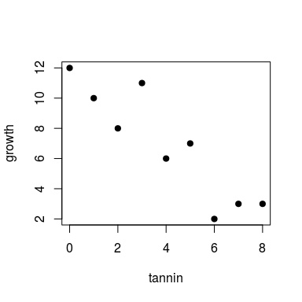

# Linear regression part 1: glm, manual ML optimization, and `optim`
Petr Keil  
March 2017  

# The data

We will use data from **Michael Crawley's R Book**, Chapter 10 (Linear Regression). The data show the growth of catepillars fed on experimental diets differing in their tannin contnent.


***

To load the data to R directly from the web:


```r
  catepil <- read.table("http://www.petrkeil.com/wp-content/uploads/2016/01/regression.txt", sep="\t", header=TRUE)
  catepil
```

```
##   growth tannin
## 1     12      0
## 2     10      1
## 3      8      2
## 4     11      3
## 5      6      4
## 6      7      5
## 7      2      6
## 8      3      7
## 9      3      8
```

The data look like this:


```r
  plot(growth~tannin, data=catepil, pch=19)
```

<!-- -->

# The model

The classical notation:
$$ growth_i = a + b \times tannin_i + \epsilon_i  $$
$$ \epsilon_i \sim Normal(0, \sigma)$$


An alternative version:
$$ \mu_i = a + b \times tannin_i $$
$$ growth_i \sim Normal(\mu_i, \sigma) $$

**Note:** The notations are mathematically equivalent, 
but the Bayesian notation shows, in my opinion, more directly 
how we think about the stochastic part of the model.


The figure is from Kruschke (2014) Doing Bayesian Data Analysis, 2nd edition, Academic Press / Elsevier.


# Fitting linear regression manually


```r
source("https://rawgit.com/petrkeil/ML_and_Bayes_2017_iDiv/master/Linear Regression/linear_regression_part0_functions.r")
```

```
## Loading required package: manipulate
```


```r
manipulate(
regr.plot(x=catepil$tannin, y=catepil$growth, a, b, sigma),
a = slider(min=0, max=15, step=0.01, initial=5),
b = slider(min=-5, max=5, step=0.01, initial=-2),
sigma = slider(min=0, max=3, step=0.01, initial=0.1)
)
```

# Linear regression fitted with ML and `optim`


```r
neg.LL.function.for.optim <- function(par, dat)
{
  x <- dat$tannin
  y <- dat$growth
  a <- par[1]
  b <- par[2]
  sd <- par[3]
  LL <- dnorm(y, mean=a + b*x, sd=sd, log=TRUE)
  neg.LL <- - sum(LL)
  return(neg.LL)
}
```


```r
optim(par=c(a=0, b=0, sd=1), 
      fn=neg.LL.function.for.optim, 
      dat=catepil)
```

```
## $par
##         a         b        sd 
## 11.754421 -1.216341  1.492704 
## 
## $value
## [1] 16.37996
## 
## $counts
## function gradient 
##      206       NA 
## 
## $convergence
## [1] 0
## 
## $message
## NULL
```


